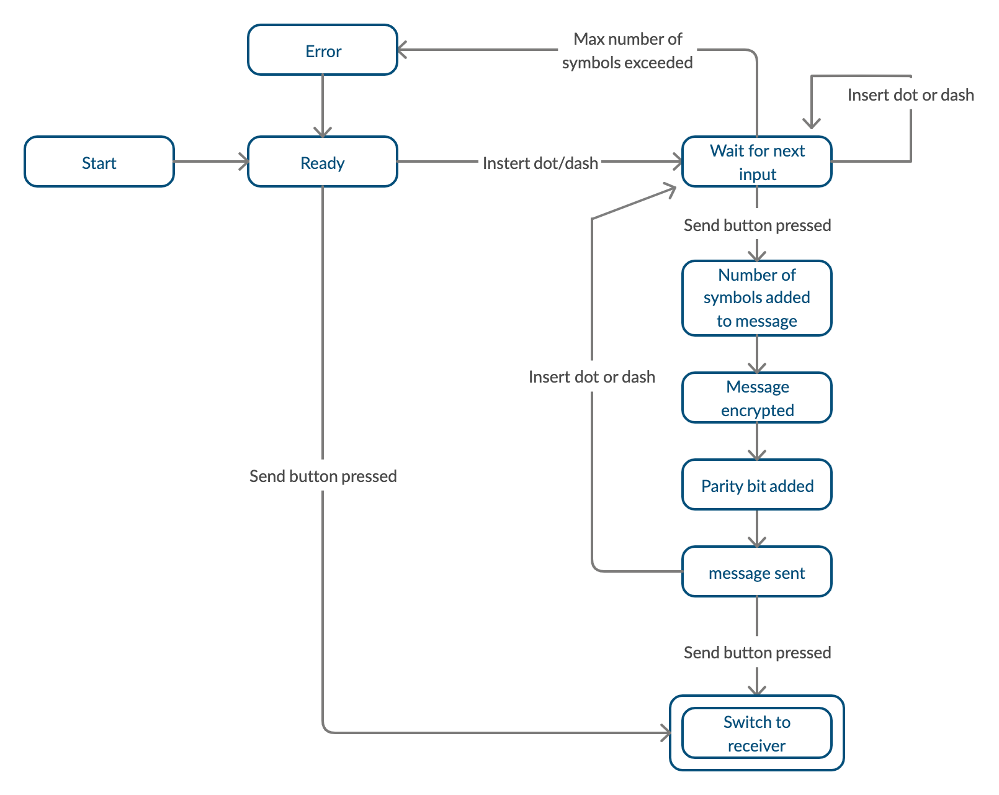

# README.md

### Program usage
This program is used to send morse code information between one micro:bit to another. 
The sender will store one ASCII character, made up of morse code symbols, at a time, and a button is pressed it will send it to the other device. The receiving device will be responsible to understand the message received (through a digital signal) and decode it into an ASCII letter. To perform this operation the ASCII characters are saved into a tree, so that the decoding of the message will be easier.


## Building Instructions

--Clone from: `"git clone https://github.com/lancaster-university/microbitsamples"
`
--Then copy `"main.cpp" `to the newly cloned `"microbit-samples/source"`

--In terminal move to `"/microbit-samples"` and run the command: `"yt build"` or `"yotta build`".

1. Files to Download
    * `/source/`
    * `main.cpp` - Main application code
    * `module.json` - Contains instructions for yotta on how to build
    * clone `microbitsamples`
---

2. Commands Required Initially
    * `yt target bbc-microbit-classic-gcc`
    * `yt build`
---

3. Running Instructions
    * The executable can be found inside `/build/bbc-microbit-classic-gcc/source`, with the executable being named `microbit-samples-combined.hex`
    * Copy this file to `user/MICROBIT`
---
### Hardware instructions
Connect two Micro:Bits via wire. For the data transmission the Micro:Bits use a digital signal, which means that both need to share the GROUND and PIN in order to establish communication. To start, the program needs to be compiled; for the receiver with the Boolean variable named "receiver" set to true, and then, for the sender, the value of the variable "receiver" set to false.
```c++
//Sender if false/ receiver if true
bool receiver = false;
```
---

### Transmission
 The Micro:bits will detect if a long or short click occurs, to choose respectevly between a dot or dash symbol. The dot symbol will dictate to the receiver to travers the left edge of a node in the Morse tree, oppositaly, if the dash symbol is detected, the receiver will know to traverse the right edge of a node in the tree. 

 For convenience, button B is used to trigger the transmission of the Morse code, which until that point, has been stored in a buffer. When an event on button B occurs, the message stored on the buffer is encrypted, a parity bit is added to the data packet, before finally being sent to the receiver where it will be decrypted and decoded.

### Data packet
The message is stored in a 9 bit data packet where the first **3 bits represent the length of the message**, followed by **a parity bit** that will be used to check the integrity of the message upon arrival and **the last 5 bits represent the actual message**.

<table>
    <thead>
        <tr align="center">
            <th colspan=10><b>Data Packet example</b></th>
        </tr>
    </thead>
    <tbody>
        <tr align="center">
            <td><b>Binary representation:</b></td>
            <td>1</td>
            <td>0</td>
            <td>0</td>
            <td>1</td>
            <td>0</td>
            <td>1</td>
            <td>1</td>
            <td>0</td>
            <td>0</td>
        </tr>
        <tr align="center">
            <td align="left"><b>Packet info:</b></td>
            <td colspan=4>Packet Header</td>
            <td colspan=5>Message</td>
        </tr>
        <tr align="center">
            <td align="left"><b>Meaning:</b></td>
            <td colspan=3>Message Length bits</td>
            <td colspan=1>Check</td>
            <td colspan=4>Message bits</td>
            <td rowspan=2>Excess bit</td>
        </tr>
        <tr align="center">
            <td align="left"><b>Decoded value:</b></td>
            <td colspan=3>4</td>
            <td colspan=1></td>
            <td colspan=4>P</td>
        </tr>
    </tbody>
</table>

We chose this approach knowing that any charachter has a maximum of 5 inputs, so a bigger data packet will never be needed.
After the data packet is received and decrypted, ones and zeros of the message section of the packet will correspond respectively to '.' and '-' symbols of the morse code.

---
#### Program flow:
#####  Write a Dot
When "button A" is pressed for a short duration(approx. anything less than 1 sec) and released it triggers an event whose pulse is calculated by the Difference of the total sleep minus the sleep time for the dot. 
#####  Write a Dash
When "button A" is pressed for long duration(approx. anything more than 1 sec) and released it triggers an event whose pulse is  calculated by the Difference of the total sleep minus the sleep time for the dash.
##### Encryption
The encryption is performed using **XOR**. The message section of the packet, before 		being sent, is encrypted by executing a **bitwise XOR** operation **between the message** section of the packet **and a key**. The packet header is left decrypted for the receiver to “understand” it.	
##### Parity Checksum
A checksum is accomplished using a ParityBit. Before being sent, the number of 1s in the packet is counted, and the parity bit will be set accordingly to have the total number of 1s even.
Upon the packets arrival, the total number of ones will be checked again, and an error during transmission will be revealed if the resulting count is odd. 
This method is effective for checking small packets of data where multiple errors during a single transmission are unlikely to happen. However this method will not be able to fully guarantee the integrity of the data.	
##### Decryption
After gathering and decoding the header information from the packet, the message 	section is decrypted.To do this a bitwise XOR is performed between the encrypted 		message and the key, revealing the information of the message.
### Modes:
To change mode (from sender to receiver), the sender must simply press the button B when the buffer is empty. This will send an empty message to the receiver that will know to set it's state to sender.

## **Final state machine showing the workings of the sender:**


## **Final state machine showing the workings of the receiver:**

---

NOTE:

1 Since a debugging tool wasn’t used to test the program many of the print statement used for testing are commented but still available in the code. Other comments are left for demonstration purposes.

2 Encryption occurs only on the last 5 bits of the data packet, which, represent the actual message. The message header is left 
deciphered. 

___
Credits:

__**Deyvid Gueorguiev**__

__**Giacomo Pellizzari**__
